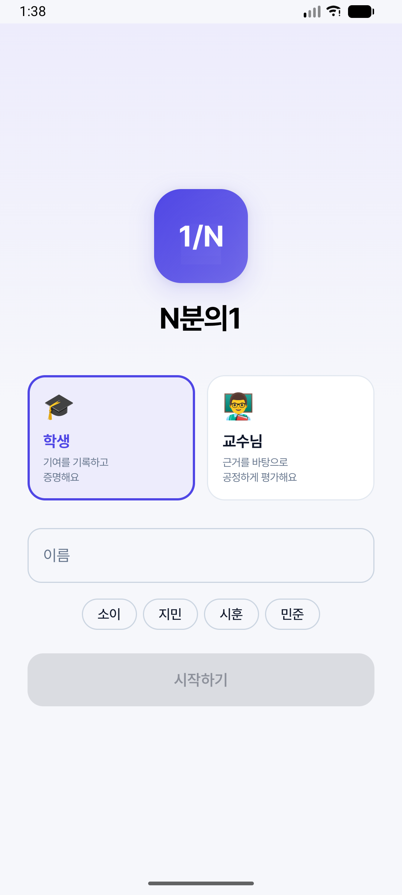
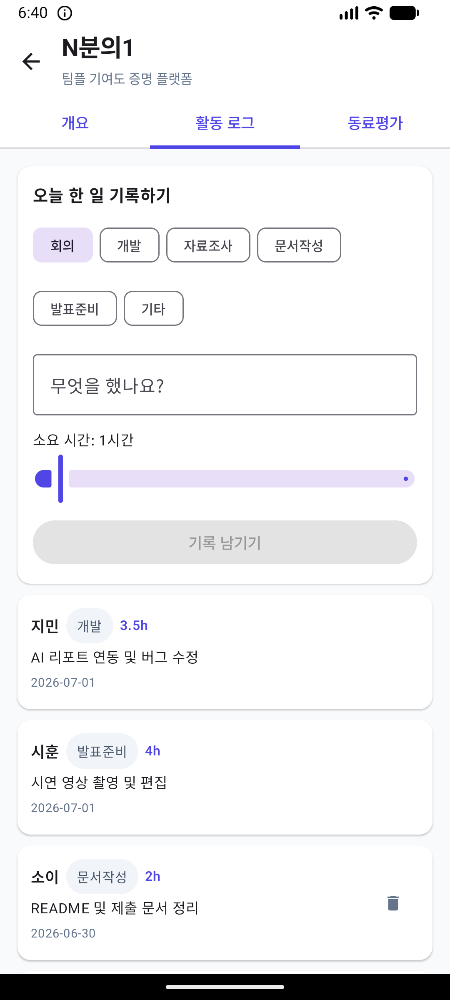
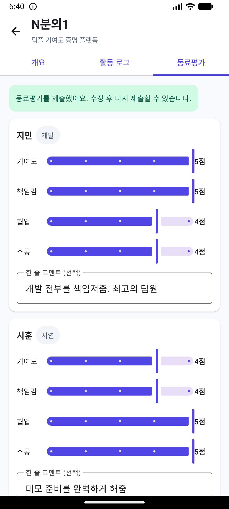
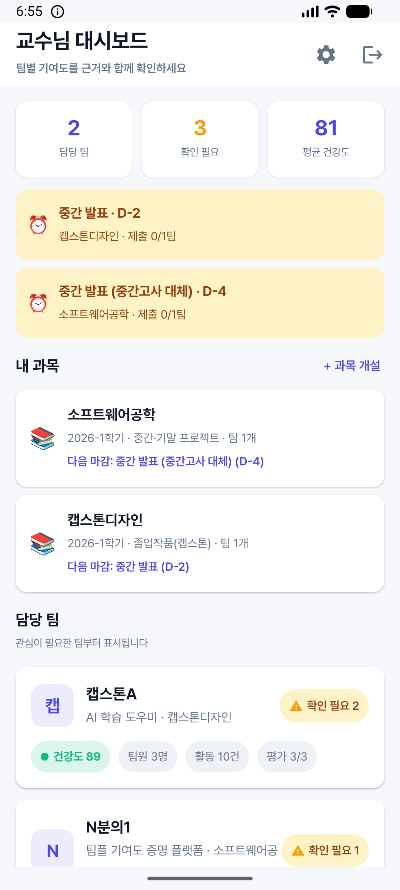
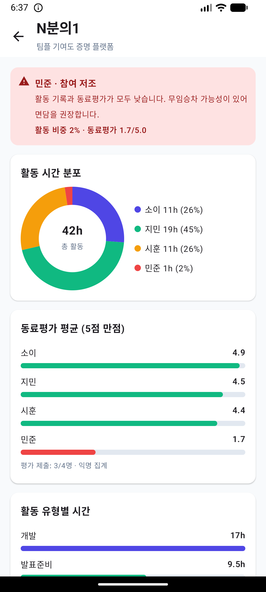
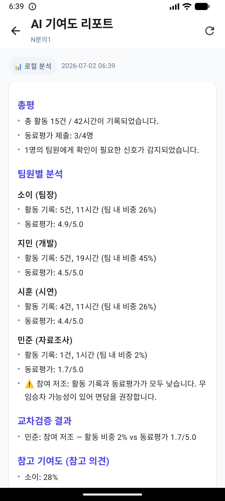
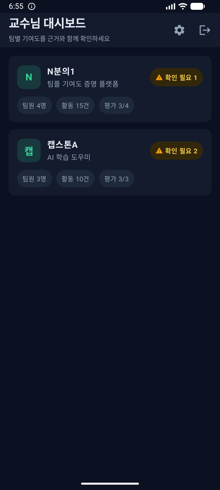
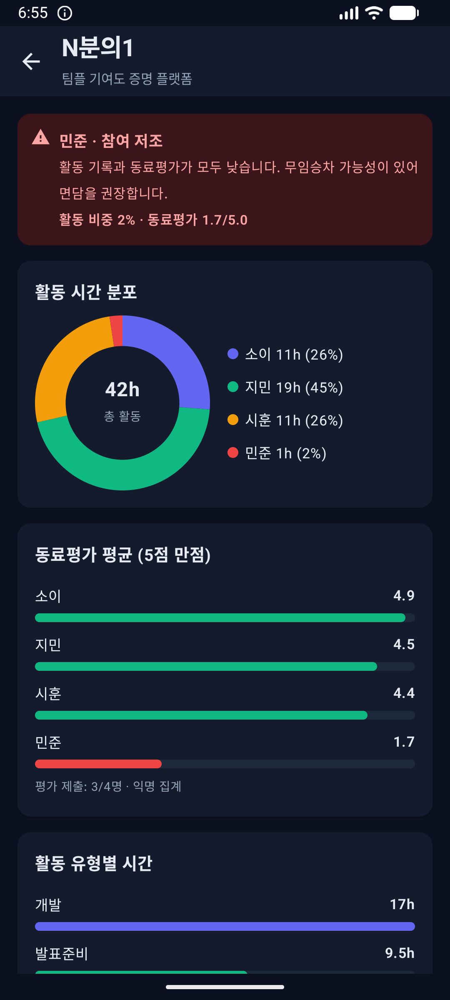
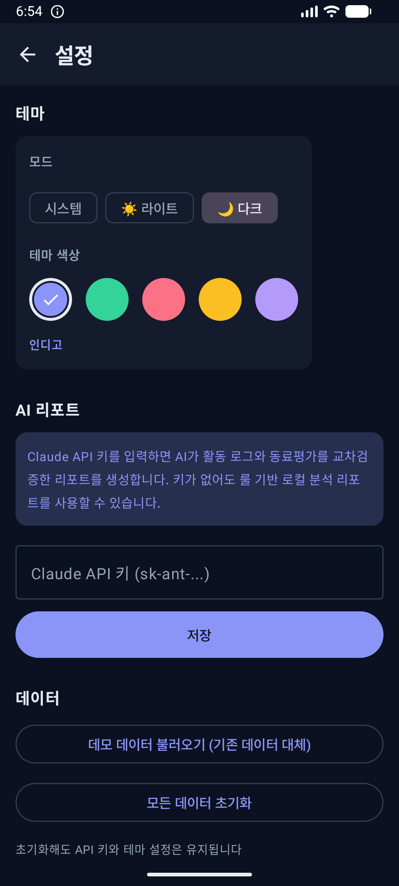
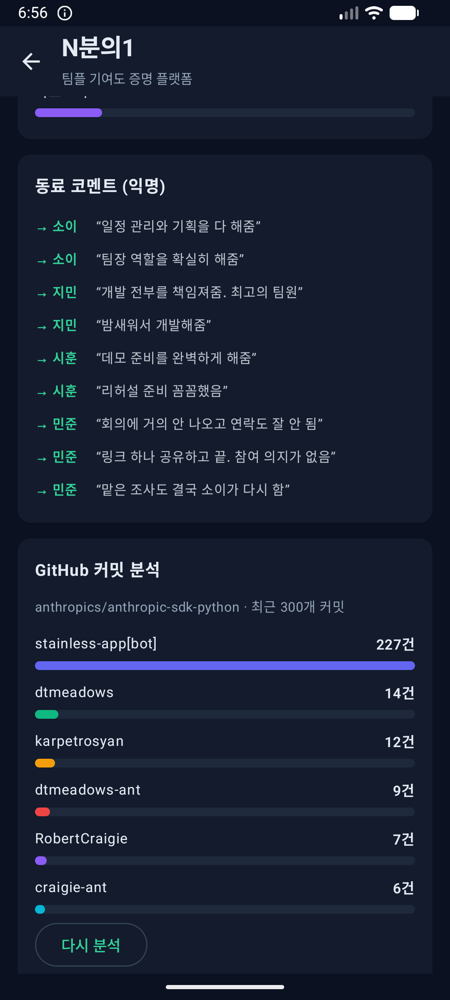

# N분의1 (1/N)

> **팀플 점수는 N분의 1로 나뉩니다. 일도 N분의 1로 나뉘었을까요?**

무임승차 없는 공정한 팀 프로젝트를 위한 **기여도 증명 플랫폼**입니다.
학생은 자신의 기여를 기록으로 증명하고, 교수님은 감이 아닌 근거로 평가합니다.

제1회 SW 해커톤 출품작 — 주제: "교수님도 써보고 싶은 앱 서비스"

## 왜 만들었나

팀 프로젝트의 가장 보편적인 고통은 무임승차입니다. 기존 해결책은 학기말 동료평가
설문 하나뿐이고, 그마저 감정싸움으로 변질되곤 합니다. N분의1은 프레임을 뒤집습니다.

- **학생에게**: 감시 도구가 아니라, 열심히 한 만큼 인정받는 **증명 도구**
- **교수님에게**: 이의제기에 방어 가능한 **근거 기반 평가 자료**

## 핵심 기능

| 기능 | 설명 |
|---|---|
| 팀 생성 · 역할 입력 | 팀장이 팀을 만들고 팀원별 역할과 담당 업무를 등록 |
| 활동 로그 | 카테고리(회의/개발/자료조사 등) + 내용 + 소요 시간을 그날그날 기록 |
| 동료평가 | 기여도·책임감·협업·소통 4개 항목 5점 척도 + 익명 코멘트 |
| 교수님 대시보드 | 팀별 활동 시간 도넛 차트, 동료평가 바 차트, 활동 유형 분석 |
| ⚠️ AI 교차검증 | **본인 기록 vs 동료평가 vs 역할** 3중 교차검증으로 불일치 자동 탐지 |
| AI 기여도 리포트 | Claude API가 근거 기반 리포트 생성 (키 없으면 룰 기반 로컬 분석) |
| 📄 PDF 내보내기 | 리포트를 PDF로 변환해 저장·공유 (인쇄, 드라이브, 메신저 등) |
| 📎 산출물 업로드 | 보고서·발표자료·코드 등 결과물 파일 첨부로 기여의 물증 확보 |
| 🐙 GitHub 커밋 분석 | 팀 저장소 커밋을 저자별로 집계해 코드 기여 시각화 |
| 🎨 테마 | 라이트/다크/시스템 모드 + 5가지 테마 색상(인디고·에메랄드·로즈·앰버·바이올렛) |
| 💬 교수자 메모 | 팀별 메모 저장 |
| 🌱 기여도 잔디 | GitHub 스타일 활동 히트맵 (학생 개인 + 교수님 팀 단위) |
| 🔥 스트릭 | 연속 기록 일수 배지 — 매일 기록하는 습관 게이미피케이션 |
| 💯 팀 건강도 | 참여 균형 + 평가 제출률 + 최근 활동성을 0~100점으로 종합 |
| 🌡️ 분위기 체크인 | 활동 기록 시 이모지로 기분 기록 → 팀 갈등·번아웃 조기 감지 |
| 📊 팀 설문 | 설문 생성 → **에브리타임 앱 직접 공유**(내용 자동 복사 → 에타 앱 실행, 미설치 시 스토어 안내) → 응답 집계 차트, 프로젝트 근거 데이터 확보 |
| 📚 **미니 LMS (과목)** | 교수님이 과목 개설 — 유형(졸업작품/중간·기말/일반) 선택 시 마일스톤 템플릿 자동 생성 |
| 🎓 졸업작품 관리 | 주제확정→계획서→중간발표→시제품→최종발표→논문 일정 관리, 팀×마일스톤 진행 매트릭스 |
| 📝 중간·기말 프로젝트 관리 | 제안서→중간발표(중간고사 대체)→최종발표(기말 대체) 일정 + 팀 제출 관리 |
| ⏰ 마일스톤 제출 | 학생이 D-day 확인, 메모·파일 첨부해 제출 — 홈에 "다가오는 마감" 자동 표시 |

### 킬러 기능: 교차검증 플래그

단순 요약이 아닙니다. 세 가지 증거가 어긋나면 자동으로 플래그가 뜹니다.

- 🔴 **참여 저조** — 활동 기록도 동료평가도 낮음 (무임승차 의심)
- 🟡 **기록·평가 불일치** — 기록은 많은데 동료평가가 낮음 (기록의 실질성 확인 필요)
- 🔵 **기록 누락 가능성** — 동료평가는 높은데 기록이 적음 (묵묵히 일하는 팀원)

AI는 점수를 확정하지 않습니다. **근거와 함께 참고 의견을 제시**하고, 최종 판단은 교수님의 몫입니다.

## 스크린샷

| 로그인 | 활동 로그 | 동료평가 |
|---|---|---|
|  |  |  |

| 교수님 대시보드 | 기여도 차트 + 플래그 | AI 리포트 |
|---|---|---|
|  |  |  |

| 🌙 다크모드 대시보드 | 다크모드 차트 | 테마 설정 | GitHub 분석 |
|---|---|---|---|
|  |  |  |  |

## 기술 스택

- **Kotlin + Jetpack Compose** (Material 3, 단일 Activity + Navigation)
- **Pretendard 폰트** 번들 (모던한 한글 타이포그래피)
- **데이터**: kotlinx-serialization 기반 JSON 파일 저장소 (오프라인 완결)
- **차트**: Compose Canvas 직접 구현 (외부 차트 라이브러리 0개)
- **AI**: Claude API (`claude-opus-4-8`) 직접 연동 + 룰 기반 로컬 폴백
- minSdk 26 / targetSdk 34

## 실행 방법

```bash
# 빌드 (Android Studio 또는 CLI)
./gradlew assembleDebug

# 설치
adb install app/build/outputs/apk/debug/app-debug.apk
```

1. 앱 실행 → 로그인 화면에서 **"데모 데이터 불러오기"** 탭
2. **교수님으로 시작하기** → 대시보드에서 팀 클릭 → 차트와 ⚠️ 플래그 확인
3. **"AI 기여도 리포트 생성"** 버튼 → 리포트 확인
4. (선택) 설정 ⚙️ 에서 Claude API 키 입력 시 실제 AI 리포트 생성

학생 플로우: 이름 칩(소이/지민/시훈) 선택 → 팀 카드 → 활동 로그 기록 / 동료평가 제출

## 보안·품질

- **API 키 암호화 저장** — Claude API 키는 평문 JSON이 아닌 `EncryptedSharedPreferences`(AES-256)에 보관
- **백업 추출 차단** — `allowBackup=false`로 adb backup을 통한 데이터 유출 방지
- **원자적 저장** — 데이터 파일은 임시 파일 → rename 방식으로 기록해 저장 중 크래시에도 원본 보존, 디스크 I/O는 백그라운드 스레드에서 처리
- **프롬프트 인젝션 방어** — 학생 입력(로그·코멘트)에 AI 지시문이 섞여 있어도 무시하고 조작 시도로 보고하도록 리포트 프롬프트에 가드 적용
- **유닛 테스트** — 기여도 계산·플래그 감지·시드 데이터 무결성 7개 테스트 (`./gradlew test`)

### 알려진 한계 (데모 범위)

- 더미 로그인이므로 실제 인증 없음 — 실서비스에서는 학교 SSO 연동 필요
- 데이터가 기기 로컬에만 저장됨 (팀원 간 실시간 공유는 서버 필요)
- 클라이언트에 API 키를 두는 구조는 데모용 — 실서비스는 서버 프록시로 전환

## 팀

| 이름 | 역할 |
|---|---|
| 소이 | 팀장 — 기획, 일정 관리, 발표 |
| 지민 | 개발 |
| 시훈 | 시연 — 데모 영상, QA |

## 데모 시나리오 (3분 영상)

1. **(30초) 문제 제기** — 4인 팀, 1명은 잠수. 다들 아는 그 상황
2. **(60초) 학생 플로우** — 팀 생성 → 활동 기록 → 동료평가 제출
3. **(60초) 교수님 플로우** — 대시보드 → 차트 → ⚠️ 불일치 플래그 → AI 리포트 생성
4. **(30초) 마무리** — "감시가 아닌 증명. 열심히 한 만큼 인정받는 팀플."
